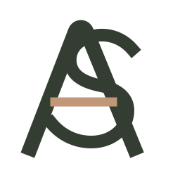
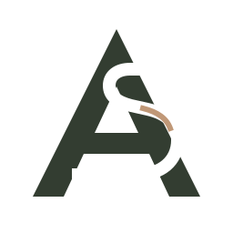

# 1c. AS-monogramvarianten voor Astrid

> **Status 8 augustus 2026:** deze concepten zijn superseded door de definitieve logobestanden die Astrid heeft aangeleverd in `newlogo082026/`. De productie gebruikt nu de aangeleverde groene en witte lockups in header, footer, favicon en structured data. De concepten hieronder blijven alleen bewaard als beslisgeschiedenis.

Beide opties bestaan alleen uit een symbool, zijn opgebouwd uit eenvoudige geometrie en gebruiken het gekozen diepolijf (`#333D31`) met een terughoudend zandkleurig accent (`#C09877`). Geen van beide gebruikt een tagline, omsluitende cirkel, schrijfletter of wellnessbeeldtaal.

## Variant A — Verweven route

De open lijn maakt de **A** stabiel, terwijl de **S** er als één doorlopende route doorheen loopt. De zandkleurige balk is tegelijk de dwarsbalk van de A en een visuele verbinding: persoonlijke begeleiding binnen een heldere professionele structuur.

- Uitstraling: toegankelijk, precies en rustig energiek.
- Past het best bij: een persoonlijke praktijk die professioneel moet voelen zonder klinisch te worden.
- Klein formaat: gebruik in de navigatie vanaf 28 px. Teken na de keuze een vereenvoudigde eenkleurige favicon; verklein dit basisbestand niet blindelings.
- Bestanden: [donker](../public/brand/concepts/as-monogram-weave-dark.svg) · [licht/negatief](../public/brand/concepts/as-monogram-weave-light.svg)

## Variant B — Stevig kader

De solide **A** vormt een stevig kader. De **S** is uit de A gesneden als negatieve ruimte en krijgt slechts één kort zandkleurig kruispunt. Zo blijft het accent terughoudend en leest het merk als een doelgerichte route binnen een vaste structuur.

- Uitstraling: steviger, formeler en zakelijker.
- Past het best bij: verwijzers, werkgevers en zorgprofessionals, waar deskundigheid als eerste moet spreken.
- Klein formaat: het solide silhouet blijft bij verkleining sterker dan Variant A; gebruik vanaf 24 px. Voor zwart-witdruk en zeer kleine favicons blijft een vereenvoudigde eenkleurige variant nodig.
- Bestanden: [donker](../public/brand/concepts/as-monogram-counterline-dark.svg) · [licht/negatief](../public/brand/concepts/as-monogram-counterline-light.svg)

De lichte SVG’s hebben een transparante achtergrond en zijn bedoeld voor de bestaande diepolijfkleurige footer of een andere donkere ondergrond. Bekijk ze daarom op `#333D31`, niet op wit.

## Toegankelijkheid en productie

- De A/S-structuur blijft zonder het zandkleurige accent herkenbaar; kleur draagt dus niet als enige de betekenis.
- Gebruik `alt="Astrid Sanders"` wanneer het beeldmerk de enige merknaam is. Gebruik `alt=""` wanneer tekst ernaast of het toegankelijke linklabel Astrid al noemt.
- Voeg de volledige naam, “leefstijlcoach” of een slogan niet toe aan het beeldmerk.
- Verfijn vóór publicatie de gekozen geometrie op 16, 24, 32 en 48 px, exporteer SVG plus transparante PNG-fallbacks en voer een visuele gelijkenis- en merkencheck uit.

## Uitkomst

Er is geen keuze tussen variant A en B meer nodig. Astrids aangeleverde eindlogo is leidend en is als geoptimaliseerde donkere, lichte en faviconvariant geïmplementeerd.
